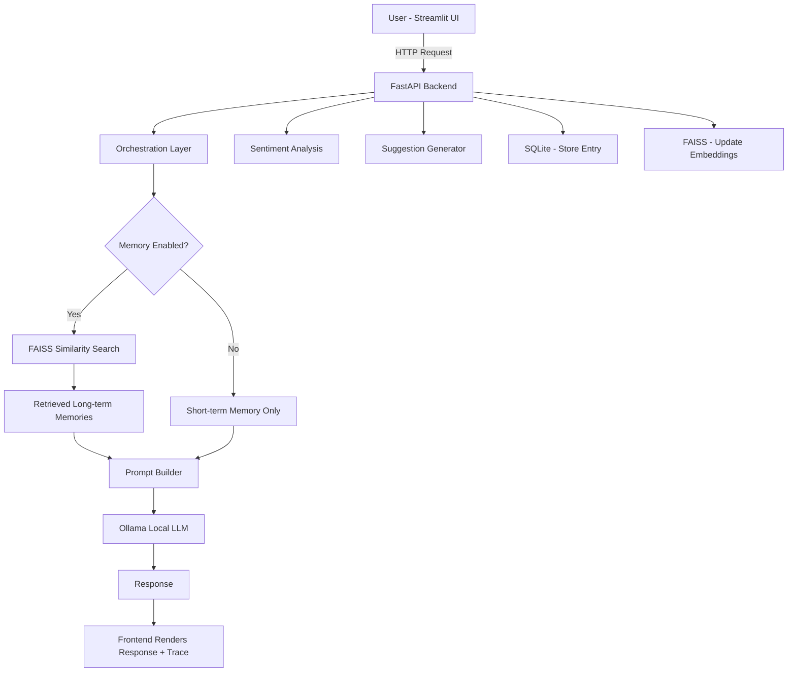

<h1 align="center">
  🪞 ReflectAI
</h1>

<p align="center">
  <strong>A memory-aware journaling assistant powered by local LLMs, RAG, and orchestration logic.</strong><br/>
  Not just a diary — an AI that remembers your story and grows with you.
</p>

<p align="center">
  
  
  
  
  
  
  
  
</p>

<p align="center">
  <a href="https://www.youtube.com/watch?v=I2FHViRYo7E" target="_blank">
    
  </a>
  <br/>
  <a href="https://www.youtube.com/watch?v=I2FHViRYo7E">▶ Watch Demo on YouTube</a>
</p>

---

## 🧠 Why ReflectAI?

Most journaling apps are just text boxes. They store what you write — but they never *remember* who you are.

**ReflectAI is different.** It combines a conversational AI interface with a hybrid memory system that retrieves your past journal entries using semantic similarity. Every response is grounded in your history, shaped by your emotions, and guided by an orchestration layer that understands your intent before the LLM even speaks.

> Built as a portfolio project to demonstrate real-world system design: RAG pipelines, vector stores, sentiment analysis, and harness engineering — all running locally with Ollama.

---

## ✨ Features

### 💬 Conversational Journaling
A clean chat interface where you write naturally. The assistant responds with thoughtful, empathetic messages — not generic replies, but ones shaped by context, memory, and your emotional state.

### 🧩 Hybrid Memory System (Short-term + Long-term)
The system maintains two memory layers working together:
- **Short-term memory** — holds your recent messages within the current session for conversational continuity
- **Long-term memory** — stores all past journal entries and retrieves the most relevant ones using semantic search

This means the assistant can say *"Last week you mentioned feeling anxious about work — has that changed?"* — because it actually remembers.

### 🔍 RAG — Retrieval-Augmented Generation
Long-term memory is powered by a full RAG pipeline:
1. Every journal entry is converted into a vector embedding
2. Embeddings are stored in a **FAISS** index
3. On each new message, a similarity search retrieves the most relevant past entries
4. Retrieved memories are injected into the LLM prompt as grounded context

This prevents hallucination and keeps responses rooted in *your* actual experiences.

### ⚙️ Orchestration Layer (Harness Engineering)
A lightweight decision controller runs before every LLM call. It determines:
- **Intent** — is this emotional journaling, reflection, or general chat?
- **Memory usage** — should past entries be retrieved?
- **Memory count** — how many memories are relevant?
- **Sentiment** — what is the emotional tone of the input?

This makes system behavior predictable, debuggable, and explainable.

### 🔎 Trace / Explainability View
Every response comes with an expandable trace panel showing the internal reasoning:
```json
{
  "intent": "emotional_journal",
  "sentiment": "negative",
  "memory_used": true,
  "memory_count": 2
}
```
This makes the system transparent — great for debugging and for demonstrating system design in interviews.

### 💡 Journaling Suggestions
After each entry, the assistant offers a guided reflection prompt tailored to your input. Suggestions are generated using:
- **Rule-based logic** for consistency and speed
- **LLM-based generation** for deeper, contextual prompts

### 📊 Sentiment Analysis
Every entry is classified as positive, negative, or neutral. Sentiment data feeds into:
- Personalized response tone
- Suggestion generation
- Insights dashboard trends

### 📈 Insights Dashboard
A visual analytics view showing your emotional patterns over time — helping you spot trends in your mood and journaling consistency.

### 📅 Calendar View
A calendar that highlights days when you journaled. Track your consistency and click any date to revisit what you wrote.

### 🎵 Ambient Music Player
Set the mood before writing. Choose from curated ambient YouTube tracks or paste your own YouTube link to play directly in the app. A small feature that makes a big difference.

---

## 🏗️ System Architecture



---

## 🔄 End-to-End Request Flow

| Step | What Happens |
|------|-------------|
| 1 | User submits a journal entry in the chat UI |
| 2 | Frontend sends `{ user_id, message, use_memory }` to FastAPI |
| 3 | Orchestration layer classifies intent and sentiment |
| 4 | Short-term memory (recent chat) is loaded |
| 5 | If memory enabled → FAISS runs similarity search on past entries |
| 6 | Relevant memories are filtered and ranked |
| 7 | Prompt is constructed with current input + memories |
| 8 | Ollama runs the LLM locally and generates a response |
| 9 | Sentiment is computed on the user input |
| 10 | A journaling suggestion is generated |
| 11 | Entry, sentiment, and timestamp are saved to SQLite |
| 12 | Embeddings are updated in FAISS for future retrieval |
| 13 | Backend returns response + suggestion + memories + trace |
| 14 | Frontend renders everything including expandable trace view |

---

## 🛠️ Tech Stack

| Layer | Technology | Why |
|-------|-----------|-----|
| Frontend | [Streamlit](https://streamlit.io) | Fast, clean UI — ideal for AI demos |
| Backend | [FastAPI](https://fastapi.tiangolo.com) | Lightweight, async, production-grade API |
| LLM | [Ollama](https://ollama.com) + Mistral | Run Mistral 7B 100% locally — no API key, no cost |
| Vector Store | [FAISS](https://github.com/facebookresearch/faiss) | Efficient similarity search over embeddings |
| Database | SQLite | Zero-setup persistent storage for entries and sentiment |
| Memory Architecture | RAG (Retrieval-Augmented Generation) | Grounds LLM responses in real past experiences |
| Embeddings | Sentence Transformers | Converts journal text into semantic vectors |
| Sentiment | Lightweight NLP module | Classifies emotional tone per entry |

---

## 📁 Project Structure

```
journal-chatbot/
├── backend/
│   ├── db/
│   │   └── sqlite_db.py          # SQLite setup, entry storage & retrieval
│   ├── llm/
│   │   ├── llm_client.py         # Ollama API client — sends prompts, streams responses
│   │   └── prompt_builder.py     # Builds structured prompts from memory + input
│   ├── memory/
│   │   ├── long_term.py          # FAISS vector store — embed, store & retrieve past entries
│   │   ├── memory_manager.py     # Coordinates short-term and long-term memory layers
│   │   ├── sentiment.py          # Classifies entry sentiment (positive / negative / neutral)
│   │   └── short_term.py        # In-session chat history for conversational continuity
│   ├── models/
│   │   └── schemas.py            # Pydantic request/response models for the API
│   ├── orchestrator/
│   │   └── router.py             # Harness layer — intent classification & memory gating
│   └── app.py                    # FastAPI entry point — defines all API routes
├── frontend/
│   └── streamlit_app.py          # Full Streamlit UI — chat, insights, calendar, music
├── assets/
│   └── demo.gif                  # Demo screen recording
├── journal.db                    # SQLite database file (auto-created on first run)
├── .gitignore
├── requirements.txt
└── README.md
```

---

## 🚀 Getting Started

### Prerequisites

- Python 3.10+
- [Ollama](https://ollama.com) installed and running locally
- A pulled Ollama model (e.g. `llama3`, `mistral`)

```bash
# Pull a model in Ollama before running
ollama pull mistral
```

### 1. Clone the repository

```bash
git clone https://github.com/your-username/journal-chatbot.git
cd journal-chatbot
```

### 2. Create a virtual environment

```bash
# Mac / Linux
python -m venv .venv
source .venv/bin/activate

# Windows
python -m venv .venv
.venv\Scripts\activate
```

### 3. Install dependencies

```bash
pip install -r requirements.txt
```

### 4. Configure environment

```bash
cp .env.example .env
```

Edit `.env` and set your Ollama model name:

```env
OLLAMA_MODEL=mistral
OLLAMA_BASE_URL=http://localhost:11434
```

### 5. Start the backend

```bash
uvicorn backend.main:app --reload
```

### 6. Start the frontend

```bash
streamlit run frontend/streamlit_app.py
```

Open `http://localhost:8501` in your browser.

---

## 🎯 Key Design Decisions

**Why RAG instead of sending all entries to the LLM?**
Sending full journal history every time would overflow the context window and increase latency. RAG retrieves only the *most relevant* past entries using semantic similarity — efficient, scalable, and more accurate.

**Why a hybrid memory system?**
Short-term memory keeps the conversation coherent. Long-term memory adds depth and personalization. Together they balance recency with history — neither alone would be sufficient.

**Why an orchestration layer?**
LLMs are powerful but unpredictable without structure. The orchestration layer adds a controlled decision layer before every LLM call — classifying intent, gating memory use, and enabling explainability through the trace view.

**Why Ollama (local LLM)?**
No API keys. No cost. No data leaving your machine. Ideal for a journaling app where privacy matters — and demonstrates the ability to deploy AI without cloud dependency.

**Why rule-based suggestions alongside LLM suggestions?**
Rule-based logic is fast and reliable for common cases. LLM suggestions add depth for nuanced emotional inputs. The hybrid approach gives the best of both.

---

## ⚖️ Trade-offs & Limitations

| Decision | Trade-off |
|----------|-----------|
| SQLite | Not horizontally scalable — works well for single-user demo |
| Local LLM via Ollama | Response quality depends on model size and hardware |
| Lightweight sentiment analysis | Not robust enough for clinical use |
| FAISS local index | No built-in persistence — must handle save/load manually |
| No authentication | Single-user only — not production-ready for multi-user |

---

## 🔮 Future Improvements

- [ ] Upgrade to better embedding models (e.g. `text-embedding-3-small`)
- [ ] Add user authentication and multi-user support
- [ ] Cloud deployment (Railway / Render / AWS)
- [ ] Advanced intent detection with fine-tuned classifier
- [ ] Stronger sentiment model (e.g. RoBERTa-based)
- [ ] Export journal entries as PDF
- [ ] Mobile-responsive UI
- [ ] Weekly emotional summary emails

---

## 🧪 System Design Summary (For Interviews)

> *"ReflectAI combines conversational AI with a hybrid memory architecture using RAG and FAISS, controlled by an orchestration layer to generate personalized and context-aware journaling experiences — running entirely on a local LLM via Ollama."*

**Core concepts demonstrated:**
- RAG pipeline implementation from scratch
- Vector similarity search with FAISS
- Harness / orchestration engineering
- Client-server API design (Streamlit + FastAPI)
- Explainability and trace logging
- Hybrid rule-based + LLM decision systems

---

## 👩‍💻 Author

**Varsha Shukla**

Built with curiosity, a lot of journaling, and way too many late nights debugging FAISS indexes.

---

## 📄 License

This project is licensed under the [MIT License](./LICENSE) — free to use, modify, and build upon.

---

<p align="center">
  If this project helped you or you found it interesting, consider giving it a ⭐ on GitHub!
</p>